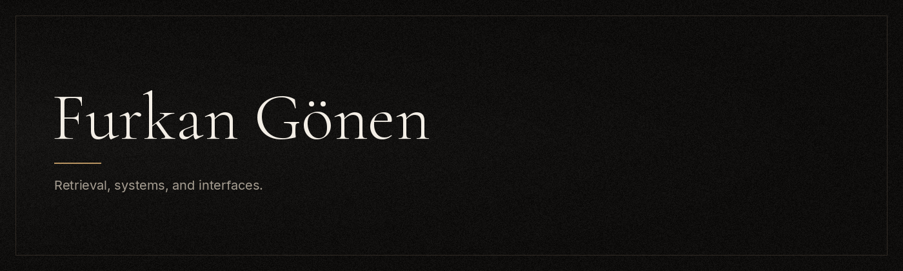

  
   
  

## AI and RAG

I care about systems that retrieve the right context and then answer. A RAG pipeline is a search step plus a model: chunk the source, embed it, store vectors, retrieve the closest passages, and ground the reply in those passages.

  
  
  
  
  
  
  
  
  
  
  
  

A useful answer cites what it retrieved. I watch chunk size, overlap, the embedding model, and whether the top passages actually contain the fact.

## Languages

  
  
  
  
  
  
  
  

## Selected work

  
  
  
  
  
  
  
  
  
  
  
  

## Graphs

  
  

  

  

## Contribution snake

  

